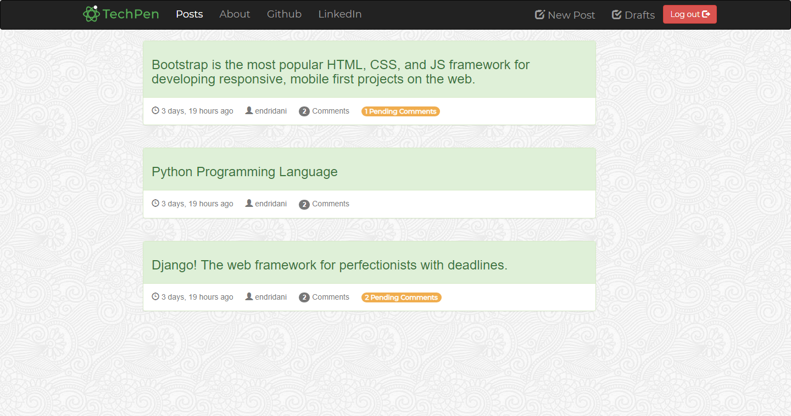
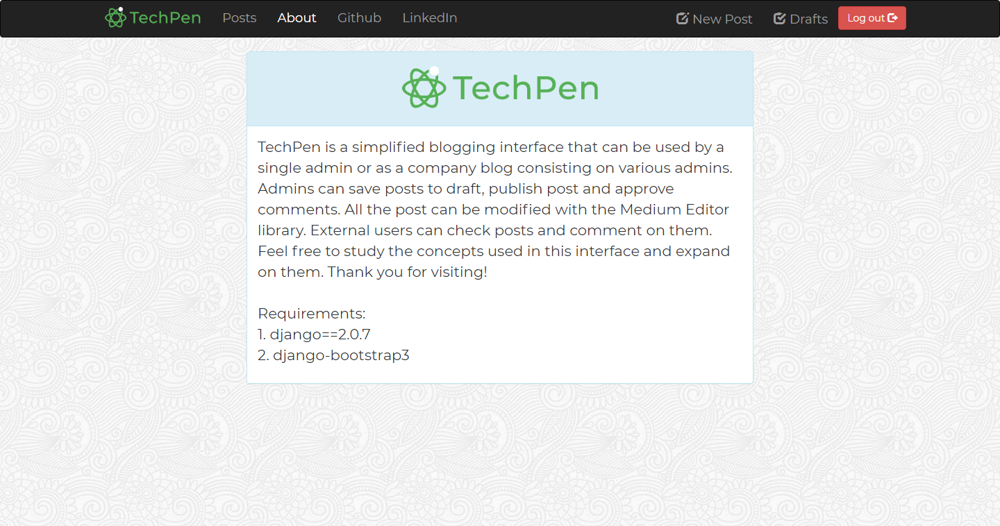

# A Simplified Blogging Interface

This simplified blogging interface serves as a good introduction to the essential layers of Django and their relations. 
A great example showcasing the usage of Class Based Views and Function Views.

Bootstrap 3 is used on the front end to give this project a nice touch on the user experience side.
Also [MediumEditor](https://yabwe.github.io/medium-editor/), serves as a great inline text customizer depening on your needs.

Screenshot samples from this Django project.

